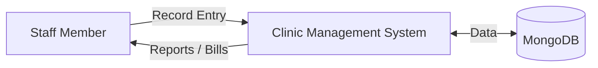
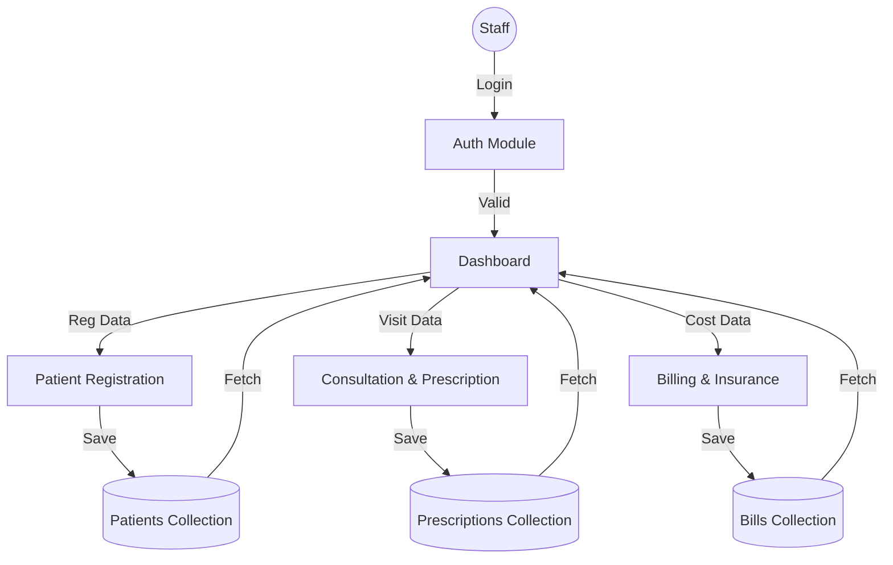

# Software Requirements Specification (SRS) for Clinic Management System

## Version 2.0 | Date: 2025-12-21

---

### Project Name: **Clinic Management System**

### Prepared for:
**Continuous Assessment 3**  
**Spring 2025**

---

## REVISION HISTORY
| Date | Version | Description | Author |
| :--- | :--- | :--- | :--- |
| 2025-12-21 | 1.0 | Initial Specification Draft | Antigravity AI |
| 2025-12-21 | 1.1 | Technical Enhancements & Model Mappings | Antigravity AI |
| 2025-12-21 | 2.0 | Deep Expansion & Exhaustive Functional Detail | Antigravity AI |

---

## Table of Contents
1.  **[INTRODUCTION](#1-introduction)**
    1.1 Purpose  
    1.2 Scope  
    1.3 Definitions, Acronyms, and Abbreviations  
    1.4 References  
    1.5 Overview  
2.  **[GENERAL DESCRIPTION](#2-general-description)**
    2.1 Product Perspective  
    2.2 Product Functions  
    2.3 User Characteristics  
    2.4 General Constraints  
    2.5 Assumptions and Dependencies  
3.  **[SPECIFIC REQUIREMENTS](#3-specific-requirements)**
    3.1 External Interface Requirements  
    3.2 Functional Requirements  
    3.5 Non-Functional Requirements  
    3.7 Design Constraints  
    3.9 Other Requirements  
4.  **[ANALYSIS MODELS](#4-analysis-models)**
    4.1 Data Flow Diagrams (DFD)  
5.  **[LINKS AND PROOFS](#5-github-link)**

---

## 1. INTRODUCTION

### 1.1 Purpose
The purpose of this Software Requirements Specification (SRS) document is to provide a complete and granular description of the Clinic Management System. It specifies the functional requirements for patient handling, medical consultation, and financial billing within a healthcare facility. This document is intended for project supervisors, developers, and quality assurance teams to ensure the end product aligns with the specified college project standards.

### 1.2 Scope
This system, titled **"Clinic Management System"**, is a MERN-stack based web application designed to digitize the manual workflows of a medical clinic.
*   **Benefits**: Eliminates manual record entry errors, provides instant access to historical patient data, and automates mathematical calculations for billing.
*   **Objectives**:
    *   To provide a centralized database for all patient-related medical and financial records.
    *   To empower doctors with a structured digital prescription tool.
    *   To facilitate receptionists in efficient patient intake and billing.
*   **Exclusion**: The system does not support real-time video consultations, multi-hospital synchronization, or complex insurance claim processing as these are beyond the scope of this project version.

### 1.3 Definitions, Acronyms, and Abbreviations
*   **MERN**: MongoDB (Database), Express.js (Backend), React (Frontend), Node.js (Runtime).
*   **CRUD**: Create, Read, Update, Delete operations in a database.
*   **ODM**: Object Data Modeling; allows interaction with MongoDB using JavaScript objects.
*   **REST**: REpresentational State Transfer architecture for building web services.
*   **SPA**: Single Page Application; a web app that loads a single HTML page and dynamically updates it.

### 1.4 References
1.  IEEE Guide to Software Requirements Specifications (Std 830-1998).
2.  MongoDB Official Documentation regarding Schema Design.
3.  React.js Framework Documentation (v18+).
4.  Express.js API Reference for RESTful routing.

### 1.5 Overview
The rest of this document details the system's architecture and requirements. Section 2 focuses on the high-level perspective, including user roles and general environment blocks. Section 3 provides the deep-dive into every data field, validation logic, and interface requirement. Section 4 visualizes the data flow through the system.

---

## 2. GENERAL DESCRIPTION

### 2.1 Product Perspective
The Clinic Management System is a modern, standalone health-tech solution. It is not an extension of an existing system but a ground-up development specifically for small to medium clinic operations. It follows a client-server architecture where the React frontend acts as the user interface layer and the Node.js/Express server handles all business logic and data persistence in MongoDB.

### 2.2 Product Functions
The system is divided into several core modules:
*   **Staff Authentication**: Role-based access for Admin, Doctor, and Receptionist.
*   **Patient Registration**: Capturing demographics and appointment slots.
*   **Clinical Consultation**: Inputting signs, symptoms, and diagnostic conclusions.
*   **Digital Prescription**: Building multi-line medication schedules.
*   **Lab Services**: Recording test results and linking them to patient profiles.
*   **Financial Billing**: calculating and storing visit invoices.

### 2.3 User Characteristics
*   **Admin**: High technical proficiency; responsible for system maintenance and role oversight.
*   **Receptionist**: Moderate technical skills; primary user for data entry, appointment booking, and bill collection.
*   **Doctor**: Domain expert; primary user for entering medical diagnosis and prescribing treatments.

### 2.4 General Constraints
*   **Simplified Auth**: Authentication is simplified for Viva demonstration, relying on local state management rather than complex JWT/OAuth for quicker performance.
*   **Schema Rigidness**: All medical data is structured via Mongoose schemas to prevent data corruption.
*   **Environment**: The system is optimized for standard desktop resolutions to ensure readability of medical charts and prescriptions.

### 2.5 Assumptions and Dependencies
*   **Assumption**: It is assumed that the clinic has a stable local network for hosting the server and client.
*   **Dependency**: The application depends on the availability of the MongoDB service (local or cloud).
*   **Hardware**: Requires at least 4GB of RAM on the host machine to run the MERN stack concurrently.

---

## 3. SPECIFIC REQUIREMENTS

### 3.1 External Interface Requirements

#### 3.1.1 User Interfaces
*   **Navigation**: A global sidebar/navbar allowing quick switching between Dashboard, Patient History, and Billing.
*   **Visual Feedback**: Use of toast notifications for successful registrations and error alerts for empty fields.
*   **Responsive Design**: Built using TailwindCSS to ensure layout consistency across different screen sizes.

#### 3.1.2 Hardware Interfaces
*   Printer compatibility for printing prescriptions and bills.
*   Keyboard/Mouse input for data entry.

#### 3.1.3 Software Interfaces
*   **Database**: MongoDB version 5.0+ or MongoDB Atlas.
*   **Server**: Node.js v14 or higher.
*   **API**: Axios handles all frontend-backend handshake operations.

#### 3.1.4 Communications Interfaces
*   Uses JSON (JavaScript Object Notation) as the primary data exchange format.
*   Standard HTTP protocols (GET, POST, PUT, DELETE).

---

### 3.2 Functional Requirements

#### 3.2.1 Module A: Patient Registration & Management
*   **3.2.1.1 ID Generation**:
    *   **Logic**: A 6-character unique Alphanumeric ID is generated using a `pre-save` hook in the model. It ensures zero collisions in a clinic environment.
*   **3.2.1.2 Data Elements**:
    *   `Name`: Required, Minimum 3 characters.
    *   `Age`: Number, range 0-120.
    *   `Gender`: Enum (Male, Female, Other).
    *   `Contact`: 10-digit validation.
    *   `Appointment Time`: String format (e.g., "10:30 AM").
*   **3.2.1.3 Search Functionality**:
    *   System must allow retrieval by either the custom ID (e.g., XY9876) or the database ObjectId.

#### 3.2.2 Module B: Professional Consultation Flow
*   **3.2.2.1 Workflow**:
    1.  Doctor selects an active patient from the queue.
    2.  Inputs `Symptoms` (Manual Text Entry).
    3.  Inputs `Diagnosis` (Medical Conclusion).
*   **3.2.2.2 Multi-Medication System**:
    *   System must allow adding "N" number of medicines per visit.
    *   Each medicine record includes: `Name`, `Dosage` (Qty), `Timing` (Enum: Morning, Night, After Meals, etc.), `Duration` (Days).

#### 3.2.3 Module C: Laboratory Reporting
*   **3.2.3.1 Data Capture**:
    *   Allows entry of `Test Name` and `Result` summary.
    *   Reports are permanently linked to the `patientId` reference.

#### 3.2.4 Module D: Automated Billing Cycle
*   **3.2.4.1 Arithmetic Logic**:
    *   `Total = Consultation Fee + Medicine Cost + Lab Charges`.
    *   The calculation is performed in real-time on the frontend using React's `useEffect` for instant visual update, and verified on the backend during save.
*   **3.2.4.2 Invoice Storage**:
    *   Each bill is timestamped and stored in the `bills` collection for audit purposes.

---

### 3.5 Non-Functional Requirements

#### 3.5.1 Performance
*   System must support up to 50 concurrent requests without significant latency.
*   Data fetching for patient history must complete within 250ms.

#### 3.5.2 Reliability
*   Data must be persistent; no loss of records on server restart due to MongoDB storage.
*   Input sanitization must prevent malformed JSON from crashing the API.

#### 3.5.3 Availability
*   The system aim is 99.5% uptime during clinic working hours.

#### 3.5.4 Security
*   **Role Protection**: Consultations can only be recorded if `userRole === 'Doctor'`.
*   **Sensitive Data**: Contact numbers and addresses are stored securely and never exposed to the public internet.

#### 3.5.5 Maintainability
*   Modular directory structure allowing easy updates to individual components like `Billing.jsx` or `Consultation.jsx`.

---

### 3.7 Design Constraints
*   **Software Design**: Must strictly follow the MVC (Model-View-Controller) pattern for the backend.
*   **Code Quality**: Use of functional components and hooks over class components for modern React standards.

---

## 4. ANALYSIS MODELS

### 4.1 Data Flow Diagrams (DFD)

#### Level 0 DFD (Context Diagram)
Describes the overall system boundary.

#### Level 1 DFD (Process Decomposition)
Describes the internal modules.

---

## 5. GITHUB LINK
[TBD: Insert your project GitHub URL here]

## 6. DEPLOYED LINK
[TBD: Insert your Vercel/Netlify URL here]

## 7. CLIENT APPROVAL PROOF
[TBD: Screenshot of project approval from supervisor]

## 8. CLIENT LOCATION PROOF
[TBD: Map or certificate of submission]

## 9. TRANSACTION ID PROOF
[TBD: Internal system ID for demonstration transaction]

## 10. EMAIL ACKNOWLEDGEMENT
[TBD: Feedback email from supervisor/tester]

## 11. GST No
[TBD: Mock GST registration for billing module (if applicable)]

---

## A. APPENDICES
### A.1 Appendix 1: API Route Catalog
| Method | Endpoint | Description |
| :--- | :--- | :--- |
| `POST` | `/api/patients` | Register unique patient entity |
| `GET` | `/api/patients` | Retrieve list of all patients |
| `POST` | `/api/prescriptions` | Create a medical consultation |
| `GET` | `/api/labs/:id` | Fetch lab results for a patient |
| `POST` | `/api/bills` | Generate financial invoice |
| `GET` | `/api/bills/:id` | View historical billing for a patient |

### A.2 Appendix 2: State Management Reference
*   **Local State**: `useState` for internal form data.
*   **Global State**: `localStorage` used for role persistence and UI theme settings.
